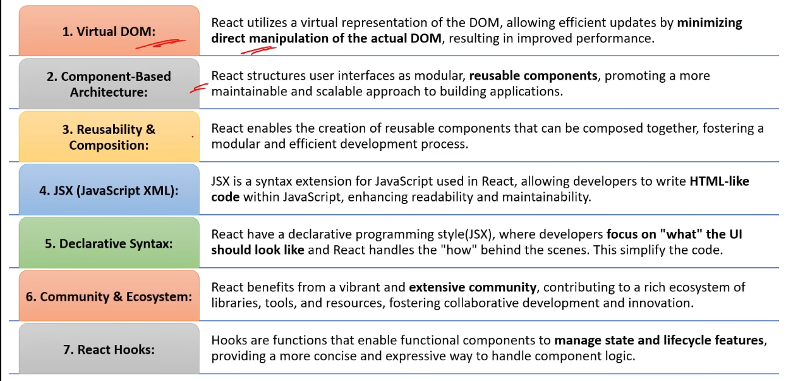
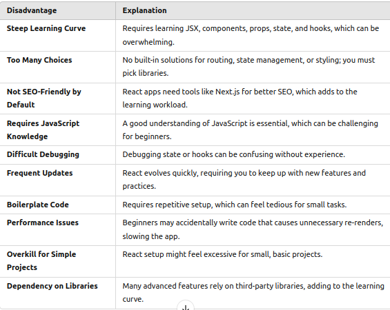

1) what is React? What is role of react in software development?

*) React is a JavaScript library for building user interfaces.
*) React is open Source
*) React is used for building user interface
*) React is used for building single page applications
*) React simplifies the creation of SPA(single page applications) by using reusable components 

2) What are the key features of React?

*) Virtual DOM
*) JSX
*) Component based architecture
*) Reusability & Composition
*) Declarative Syntax
*) Community & Ecosystem
*) React Hooks
reference : 

3) What is DOM ? What is diff between HTML and DOM?

*) Document Object Model (DOM) represents the web page as a tree-like structure which allows javascript to dynamically access and manipulate the content of the page and structure of a web page
*) HTML is a markup language for reading and writing web pages

4) What is Virtual DOM? What is diff between DOM and Virtual DOM?

*) React uses virtual DOM to efficiently update the UI without re-rendering the entire page,which helps improves performance and make the application more responsive
*) 

5) What are React components? what are the main elements of it ?

*) React components is reusable  building block for creating user interfaces

6) What is SPA(Single Page Application)?

*) A single page application (SPA) is a web application that have only one single web page 
*) Whenever user do some action on the website, then in response content is dynamically updated without refreshing or loading a new page.

7) What are 5 advantage of React?

*) Simple to build Single Page Application(by using components)
*) React is cross platform and open source(free to use)
*) Lightweight and very fast (Virtual DOM)
*) Large Community and Ecosystem
*) Testing is easy

8) What are the disadvantages of React?

9) What is te role of JSX in React?

**) we use react lib BABEL to convert react code to java script
*) JSX(javascript XML) is a syntax extension for JavaScript
*) JSX is used by react to write HTMLlike code

10) What is diff between Declarative and Imperative?

*) Declarative syntax focuses on describing the desired result without specifying the step-by-step process , JSX in react is used to write declarative syntax
*) Imperative syntax involves step-by-step process to achieve a particular goal, javascript has an imperative syntax