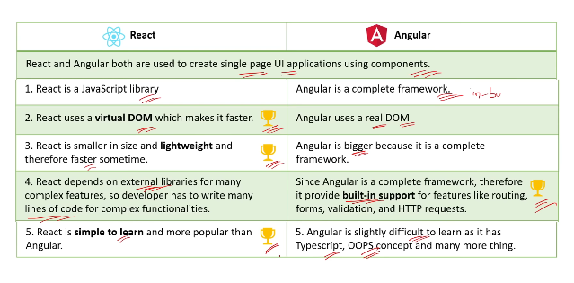

1) What is Arrow Function?

the arrow function expression syntax is a concise way of defining functions.

2) How to setup react project?

3) What are the Main Files in a React Project?

*) index.html : single page for react application
*) components/component1.js : component for react application
*) App.js : main component or container or root component
*) App.test.js(optional) : used for writing tests for App.js file
*) Index.css(optional) : this is a global css file that serves as the main stylesheet for the entire application
*) index.js: entry point for JavaScript,Renders the main react component(APP) into the root DOM element

4) How React App Load and display the components in browser?

5) What is the difference between React and Angular?

6) What are other 5 JS Frameworks other than React?

*) Vue.js
*) Angular
*) Ember.js
*) Backbone.js
*) AngularJS

7) Whether React is a framework or a library?

*) React is officially considered a library, not a framework. It is a JavaScript library for building user interfaces, developed and maintained by Facebook (now Meta).
*) Library: Developers import the libraries at the top and then used its functions in components.

8) How React provides Reusability and Composition?

*) Reusability: We can reuse the same component multiple times in different parts of the application.
*) Composition: Composition is creating new and big components by combining existing small components.Its advantage is change to one small component will not impact other component.

9) What are state,stateless,stateful components and state management terms?

*) State - current data of the component
*) Stateful component - component that has state
*) Stateless component - component that does not have state
*) State management - way of storing and updating the state
