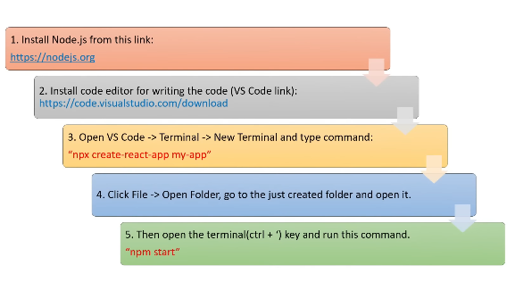
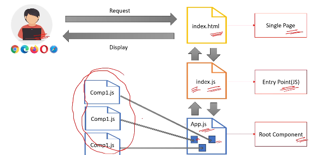
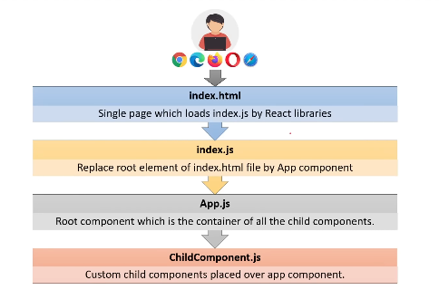

1) What is Arrow Function?

the arrow function expression syntax is a concise way of defining functions.

2) How to setup react project?

3) What are the Main Files in a React Project?

*) index.html : single page for react application
*) components/component1.js : component for react application
*) App.js : main component or container or root component
*) App.test.js(optional) : used for writing tests for App.js file
*) Index.css(optional) : this is a global css file that serves as the main stylesheet for the entire application
*) index.js: entry point for JavaScript,Renders the main react component(APP) into the root DOM element

4) How React App Load and display the components in browser?

